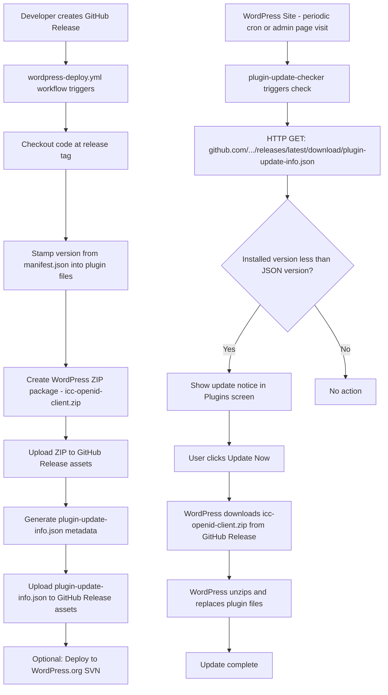

# GitHub-Based Plugin Update Mechanism

## Overview

This plan adds built-in update capability to the ICC OpenID Client plugin, replicating how WordPress.org-hosted plugins handle updates — but using GitHub Releases as the source. Users will see update notifications in their WordPress admin and can perform one-click updates without installing any third-party plugins.

## Architecture

### Update Flow



### Key URLs

| Purpose | URL |
|---------|-----|
| **Metadata (always latest)** | `https://github.com/ivancarlosti/wordpressiccopenidclient/releases/latest/download/plugin-update-info.json` |
| **ZIP download (per release)** | `https://github.com/ivancarlosti/wordpressiccopenidclient/releases/download/v{version}/icc-openid-client.zip` |

The `releases/latest/download/` URL is a GitHub redirect that always points to the most recent release's asset — no commits or repo changes needed per release.

---

## Implementation Steps

### Step 1: Add Plugin Update Checker dependency

**File:** `composer.json`

Add `yahnis-elsts/plugin-update-checker` to the `require` section:

```json
"yahnis-elsts/plugin-update-checker": "^5.0"
```

Run `composer update` to install the library. It will be autoloaded via the existing `vendor/autoload.php` (already required in `bootstrap()`).

### Step 2: Initialize update checker in the plugin

**File:** `icc-openid-client.php`

Inside the `bootstrap()` method, after the plugin instance is created but before `add_action('init', ...)`, add:

```php
// GitHub-based update checking (mimics WordPress.org update API).
add_action('init', function () {
    if (!class_exists(\YahnisElsts\Plugin\UpdateChecker\v5\PucFactory::class)) {
        return;
    }
    \YahnisElsts\Plugin\UpdateChecker\v5\PucFactory::buildUpdateChecker(
        'https://github.com/ivancarlosti/wordpressiccopenidclient/releases/latest/download/plugin-update-info.json',
        __FILE__,
        'icc-openid-client'
    );
}, 0);
```

This uses a priority-0 init hook so the update checker registers before most plugins.

### Step 3: Generate metadata JSON in the deploy workflow

**File:** `.github/workflows/wordpress-deploy.yml`

Two new steps are added after step 5 (Upload WordPress ZIP to GitHub Release):

#### Step 3a: Generate `plugin-update-info.json`

```yaml
- name: 📝 Generate update metadata JSON
  run: |
    VERSION="${{ steps.version.outputs.version }}"
    DOWNLOAD_URL="https://github.com/${{ github.repository }}/releases/download/${{ steps.version.outputs.tag }}/${{ steps.version.outputs.zip_name }}"

    # Extract requires/requires_php/tested from plugin header
    REQUIRES_WP=$(grep -oP 'Requires at least:\s*\K[0-9.]+' ${PLUGIN_SLUG}.php || echo "5.0")
    REQUIRES_PHP=$(grep -oP 'Requires PHP:\s*\K[0-9.]+' ${PLUGIN_SLUG}.php || echo "8.1")
    TESTED_UP_TO=$(grep -oP 'Tested up to:\s*\K[0-9.]+' readme.txt || echo "6.7")

    # Extract changelog from readme.txt (from == Changelog == to next top-level == section or EOF)
    CHANGELOG=$(awk '/^== Changelog ==/{found=1; next} found && /^== /{exit} found' readme.txt)

    jq -n \
      --arg version "${VERSION}" \
      --arg download_url "${DOWNLOAD_URL}" \
      --arg requires_wp "${REQUIRES_WP}" \
      --arg requires_php "${REQUIRES_PHP}" \
      --arg tested "${TESTED_UP_TO}" \
      --arg homepage "https://github.com/${{ github.repository }}" \
      --arg description "Connect to an OpenID Connect identity provider using Authorization Code Flow. Features email domain restriction and SSO." \
      --arg author "Ivan Carlos" \
      --arg author_uri "https://ivancarlos.me" \
      --arg changelog "${CHANGELOG}" \
      '{
        version: $version,
        download_url: $download_url,
        last_updated: (now | strftime("%Y-%m-%d")),
        requires: $requires_wp,
        requires_php: $requires_php,
        tested: $tested,
        homepage: $homepage,
        author: $author,
        author_profile: $author_uri,
        sections: {
          description: $description,
          changelog: $changelog
        }
      }' > plugin-update-info.json

    echo "Generated plugin-update-info.json:"
    cat plugin-update-info.json
```

#### Step 3b: Upload metadata to the GitHub Release

```yaml
- name: 📤 Upload update metadata to GitHub Release
  env:
    GH_TOKEN: ${{ secrets.GITHUB_TOKEN }}
  run: |
    gh release upload "${{ steps.version.outputs.tag }}" \
      plugin-update-info.json --clobber

    echo "Update metadata uploaded to release ${{ steps.version.outputs.tag }}"
```

Both steps go after the existing step that uploads the WordPress ZIP (line 111 in the current file) and before the SVN deploy check (line 119).

---

## Files Modified

| File | Change |
|------|--------|
| [`composer.json`](composer.json) | Add `yahnis-elsts/plugin-update-checker` dependency |
| [`icc-openid-client.php`](icc-openid-client.php) | Initialize update checker in `bootstrap()` |
| [`.github/workflows/wordpress-deploy.yml`](.github/workflows/wordpress-deploy.yml) | Add 2 steps: generate & upload `plugin-update-info.json` |

**No changes to `.github/workflows/build.yml`** — as required.

---

## How It Works (User Perspective)

1. **Update notification**: When a new GitHub release is published, the plugin checks `releases/latest/download/plugin-update-info.json`. If the version is newer than installed, WordPress shows the standard update notice on the Plugins screen.

2. **One-click update**: The user clicks "Update Now". WordPress downloads `icc-openid-client.zip` from the GitHub Release, unzips it, and replaces the plugin files — exactly like a WordPress.org-hosted plugin.

3. **Automatic updates**: If the user has WordPress auto-updates enabled for plugins, the update will happen automatically.

4. **View version details**: Clicking "View version details" in the update notice shows the changelog and description pulled from the metadata JSON.

---

## Edge Cases & Notes

- **First release after implementation**: The `plugin-update-info.json` must be uploaded to the release. Existing releases without this file won't trigger updates.
- **GitHub rate limits**: Since we use a static JSON file (not the GitHub API), there are no rate limit concerns — `releases/latest/download/` serves files without API authentication.
- **Plugin still on WordPress.org**: The existing SVN deploy step is unchanged. Users who installed from WordPress.org will continue receiving updates through that channel. Users who installed manually from GitHub will receive updates through this new mechanism.
- **Compatibility**: The `plugin-update-checker` v5.x requires PHP 7.4+. The plugin already requires PHP 8.1, so this is fine.
